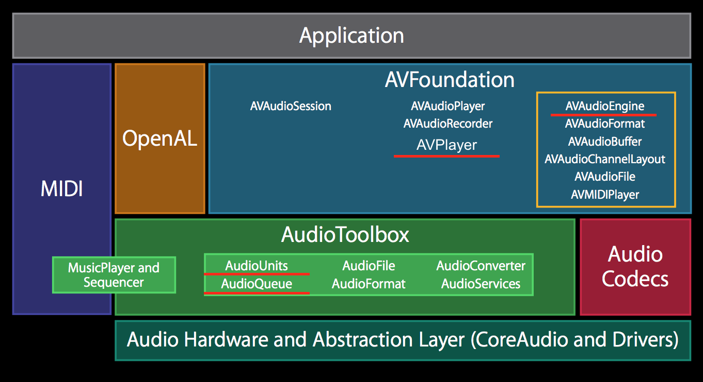
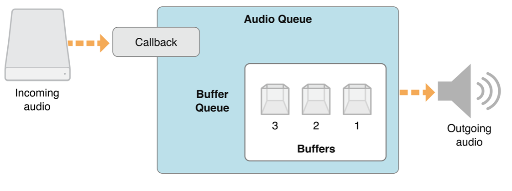
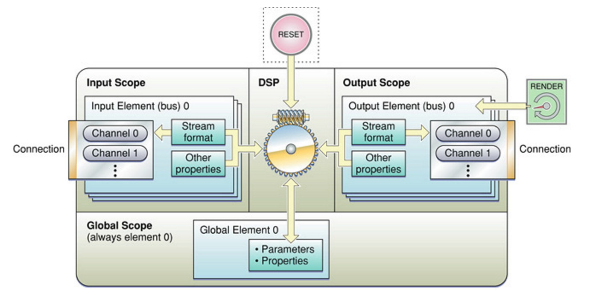
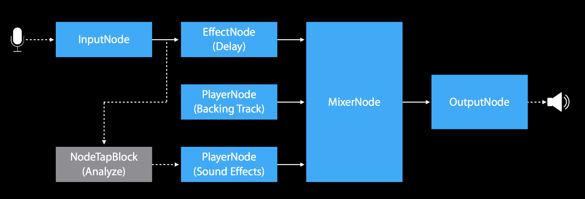

# Audio Streaming on iOS

---

# Overview

### Streaming
### iOS Audio APIs

---

# Background

###
### classical music :violin: streaming app :speaker:

^ Venture by universal music, initially developed by an agency then hired a team to take over the product, tasked with fixing the player

---

# Streaming

^ multimedia that is constantly received by and presented to an end-user while being delivered by a provider. is an alternative to file downloading, a process in which the end-user obtains the entire file for the content before watching or listening to it.

---

# vs. downloading

- immediate* availability 

^ no need to wait for the whole file to download

- does not require disk space (:apple::tv:)

^ the data is loaded into memory, decoded, fed to output and then discarded, optionally cached

- adaptability (different levels of quality available)

^ with downloading you have to make the tradeoff between download time and quality at the beginning of the download

- requires minimum bandwidth (~32kbps for music)

^ with AAC-HEv2 compression

---

# Segmentation

^ the basic concept is spliting a large file into smaller playable chunks and send them over the network

---

## packets over UDP or TCP

* Adobe Flash (RTMP)
* RTSP, RTP and RTCP

^ RTSP, RTP and RTCP are protocols standardized by IETF in the 90s

---

## over HTTP

* using request header e.g. `Range: bytes=500-999`
* Apple HLS
* Microsoft Smooth Streaming
* MPEG-DASH

^ although the first approach is more efficient, in practice it's outweighted by the economics and scalability of HTTP
^ Apple's HLS v1-v3 segment the file in ~10s audio files while v4 keeps a single file but specifies the byte ranges for each segment

---

## Overview of Core Audio



---

## AVPlayer

 - high level API: URL as input, sound as output

^ the URL can be both to an on-disk file or a network resource

 - provides an implementation of Apple's HLS client
 
^ can handle both audio and video

 - use KVO to observe its dynamic properties: `status`, `rate`, `currentItem`

```
let url = URL(string: "http://apple.co/1cDWZsp")!
let player = AVPlayer(url: url)
player.play()
```
^ also curl -L http://bit.ly/2dthQd3
^ https://s3-eu-west-1.amazonaws.com/gapless-test/hls/symphony-5-4symphony-5-4-_v4.m3u8

---

# Tiny Demo

^ present contents of HLS files, for both versions of HLS

---

## Why go deeper?

- access to modify audio samples
- mixing multiple audio sources together
- audio processing effects such as delay, reverb etc.
- implement gapless playback

---

## Core Audio definitions

- sample

^ is single numerical value for a single channel.

- frame

^ A set of samples representing one sample for each channel. The samples in a frame are intended to be played together (that is, simultaneously)

- packet

^ The smallest, indivisible block of data. For linear PCM (pulse-code modulated) data, each packet contains exactly one frame. For compressed audio data formats, the number of frames in a packet depends on the encoding. For example, a packet of AAC represents 1024 frames of PCM.

---

## Audio file stream services
### allow parsing incoming bytes for metadata and audio packets
### `import AudioToolbox`

---

## Audio file stream services

1. AudioFileStreamOpen(AudioFileStream_PacketsProc, AudioFileStream_PropertyListenerProc)

2. AudioFileStreamParseBytes()

3. receive calls to AudioFileStream_PacketsProc or AudioFileStream_PropertyListenerProc

4. AudioFileStreamClose()

^ AudioFileStream_PacketsProc is a pointer to a C function, a callback that is triggered when packets have been parsed, same thing for AudioFileStream_PropertyListenerProc, but that's for metadata about the stream, file format, byte counts, frames per packet, samples per frame etc

^ and feed the data to the audio playback API

---

# Audio Queue Services



static void HandleOutputBuffer(void *aqData, AudioQueueRef inAQ, AudioQueueBufferRef  inBuffer)

---

# Audio Unit



^ on a plugin basis
^ multiple inputs & outputs possible, a chain or a graph of this type of components can be built

several provided by Apple: for file input, mixing, effects and output

^ similar to AVAudioEngine, in fact it's the base for it

---

# AVAudioEngine

- newer API ~> iOS 8 
- Obj-C / Swift API set
- low latency, real-time audio
- connect audio processing blocks

---

# AVAudioEngine

Building blocks:

- Engine (AVAudioEngine)
- Node (AVAudioNode)
- Output node (AVAudioOutputNode)
- Mixer node (AVAudioMixerNode)
- Player node (AVAudioPlayerNode)

---

# AVAudioEngine



^ since iOS 9 AVAudioConverter is available which allows converting from a AVCompressedBuffer to an AVPCMBuffer that can be fed to a player node

---

## Takeaway

Three ways to play streamed audio:

1. AVPlayer: high level, built-in HLS support, covers almost all needs, no access to buffers
2. Audio Queue Services: high level C API, simple to grasp concept, access to buffers
3. Audio Unit: low level C API, allows effects & mixing
4. AVAudioEngine: Obj-C/Swift wrapper for Audio Unit & Toolbox, under improvement

---

## Thanks! Any questions?

---


